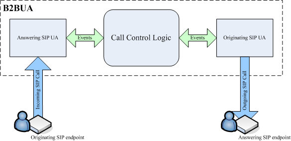
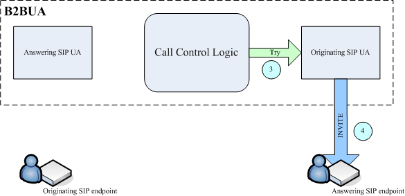
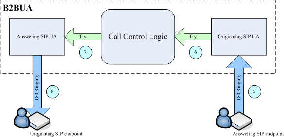
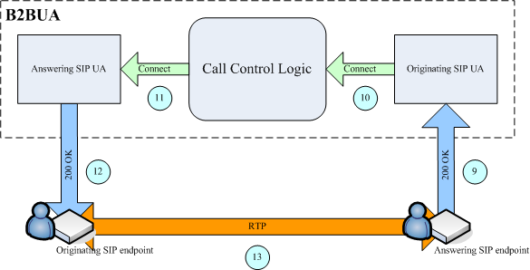
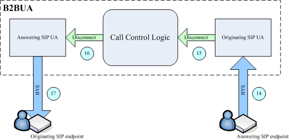

## Introduction

The Back-to-Back User Agent (B2BUA) is a Session Initiation Protocol (SIP)
call-controlling component. Unlike a SIP proxy server, which only maintains a
transaction state, the B2BUA maintains the complete call state and participates
in all call requests. For this reason, the B2BUA can perform a number of
functions that are not possible to implement using the SIP proxy, such as
accurate call accounting, pre-paid rating & billing, failover call routing, and
so on.

The B2BUA is involved in call establishment, management, and termination.

## Architecture

B2BUA High Level Architecture

The B2BUA consists of the following three main logical components:

- Answering SIP User Agent
- Call Control Logic
- Originating SIP User Agent

The following diagram illustrates the B2BUA architecture and the primary
components.




The components interact with each other using abstract events. Each User Agent
(UA) represents a state machine, which receives SIP messages from the endpoint
and converts them into events based on the type of message and the agent's own
current state. The Call Control Logic acts as a go-between, passing events
between the UAs. Depending on its own current state and the states of the UAs,
the Call Control Logic could drop some events, convert event type in transition,
or inject additional events. It can also remove one of the UAs and replace it
with another one on different stages of the call, which allows implementing
such features as fail over call routing, controlled call transfer and so on.

Since the number of parameters passed by each event is well defined the B2BUA
can isolate call legs from each other, allowing only controlled amount of
information to pass through.

This architecture allows implementing different functionality by replacing the
Call Control Logic, which consists of a small fraction of the B2BUA code. Two
such implementations are described in the next section.

## Typical Call Process

A call is initiated when the Answering SIP UA receives an incoming INVITE
message from the Originating SIP Endpoint. After receiving this message, the
Answering SIP UA generates a Try event (2) and passes it to the Call Control
Logic, as illustrated in the following diagram.


The Call Control Logic receives the Try event, performs authentication and
authorization, creates the Originating SIP UA, modifies the Try event to
accommodate for any parameter translation logic, and passes it along with the
routing information to the Originating SIP UA (3). The Originating SIP UA
receives the Try event and generates INVITE message (4) as shown in the
following diagram.




After the Answering SIP endpoint receives the INVITE message, it starts ringing
and sends back an 18x SIP provisional response (5). The Originating SIP UA
receives the message, generates a Ringing event, and passes it to the Call
Control Logic (6). The Call Control Logic receives the Ringing event and
passes it to the Answering SIP UA (7), and in response, the Answering SIP UA
sends an 18x SIP provisional response to the Originating SIP endpoint (8).




When the user at the Answering SIP endpoint picks up the phone, the endpoint
generates a 200 OK SIP response and sends it back to the Originating SIP UA
(9). The UA generates a Connect event and passes it to the Call Control Logic
(10), following which the Call Control Logic hands the event over to the
Answering SIP UA (11). The UA sends a 200 OK message to the Originating SIP
endpoint (12). At this point, the session is established and endpoints start
exchanging RTP media (13).




When either party hangs up, the respective SIP endpoint generates a SIP BYE
message and sends the message to the associated SIP UA (14). The UA generates
a Disconnect event, which propagates to the other side of the B2BUA via the
Call Control Logic (15), (16) and results in a BYE message, which is sent to
the other endpoint (17).




The session ends.

## B2BUA Implementations

### Simple B2BUA

#### Description

Simple B2BUA represents very basic SIP back to back user agent. It accepts
incoming SIP calls on the specified IP address and for each incoming call leg
establishes outgoing call leg to the pre-defined IP address. It does not
perform authentication or authorization for incoming calls and passes all
main parameters (CLD, CLI, SDP body, Caller Name, Callee Name) from incoming
call leg to outgoing call leg verbatim. The main purpose of this B2BUA is to
serve as an example for building more complex call control logic.

#### Depends on:
- Python 3.4 or later

#### Synopsis

To invoke the B2BUA use the following command:

```
python b2bua_simple.py [-f] [-L logfile] [-l local_ip] [-p local_port] [-n remote_ip]
```

Options enclosed in square brackets are optional.

The following options are available:

- `-f` run in the foreground (by default B2BUA becomes daemon after
  invocation);
- `-L logfile` path to the file into which B2BUA should redirect its stdout and
  stderr (by default, B2BUA uses /var/log/b2bua.log)
- `-l local_ip` specific IP address on which B2BUA will listen
- `-p local_port` specific UDP port number for listening for incoming SIP
  messages at (by default the B2BUA uses port 5060);
- `-n remote_ip` IP address of the target for the outgoing call legs.

For example, the following command will instruct B2BUA to listen for incoming
SIP calls on IP address 192.168.0.15 and forward all outgoing calls to SIP
endpoint with IP address of 192.168.1.25:

`python b2bua_simple.py -l 192.168.0.15 -n 192.168.1.25`

There are several environment variables that can be used to control how B2BUA
logs its SIP-related activities:

- `SIPLOG_BEND` specifies which method of reporting to use. Available methods
  are logfile and stderr (default);
- `SIPLOG_LVL` specifies logging level, that is how detailed the log file
  should be. The following levels are available:
  - `DBUG`
  - `INFO` (default)
  - `WARN`
  - `ERR`
  - `CRIT` (from the most verbose to the least verbose);
- `SIPLOG_LOGFILE_FILE` when logfile method is selected allows specifying
  location of the logfile (`/var/log/sip.log` by default).

### RADIUS B2BUA

#### Description

RADIUS B2BUA represents advanced SIP back to back user agent designed to be
used with [RFC2865](http://tools.ietf.org/html/rfc2865) / 
[RFC2866](http://tools.ietf.org/html/rfc2866) compliant RADIUS billing engines.
It accepts incoming SIP calls on the specified IP address, performs
authentication and authorization using RADIUS protocol and if it has been
successful establishes outgoing call leg to either pre-defined IP address or
address returned by the RADIUS server in a custom attribute. It also allows
RADIUS server to alter number of parameters in the outgoing call leg (CLD, CLI,
Caller Name, Callee Name). Once the call has been completed or has been failed
it can send RADIUS accounting.

The B2BUA uses RADIUS AAA attributes as per [Cisco CDR Accounting for Cisco IOS
Voice
Gateways](http://www.cisco.com/c/en/us/td/docs/ios/voice/cdr/developer/guide/cdrdev.html),
which provides compatibility with many billing platforms. The authentication
could be performed either using Cisco-compatible Remote IP method, or by using
secure digest method proposed in RADIUS Extension for Digest Authentication
IEFT draft.

#### Depends on:
- Python 3.4 or later
- radiusclient-ng 0.5.0 or later (Note, see [#12](https://github.com/sippy/b2bua/issues/12)
)

#### Synopsis

```
python b2bua_radius.py [-fDu] [-l local_ip] [-p local_port] [-P pidfile] [-L logfile]
  [-s static_route] [-a ip1[,..[,ipN]]] [-k 0-3] [-m max_ctime] [-A 0-2]
  [-r rtp_proxy_contact1] [-r rtp_proxy_contact2] ... [-r rtp_proxy_contactN]
```

Options enclosed in square brackets are optional. The following options are
available:

- `-f` run in the foreground (by default, B2BUA becomes the daemon after
  invocation)
- `-D` do not use secure digest authentication
- `-u` disable (do not send) RADIUS Authentication/Authorization. If this flag
  is specified, the B2BUA does not send any Authentication/Authorization
  requests to the RADIUS server. Unless the -a option is also specified, the
  B2BUA in this mode will accept incoming sessions from any IP address without
  any limitations. This flag depends on the -s flag, since in this case, B2BUA
  is not able to get routing information from the RADIUS replies.
- `-A 0-2` RADIUS accounting level. Argument in the range 0-2 specifies the
  level as follows:
  - 0 disable (do not send) RADIUS accounting
  - 1 enable sending Stop RADIUS accounting records (this mode is default)
  - 2 enable sending both Start and Stop RADIUS accounting records
- `-l local_ip` specific IP address to listen for incoming SIP messages
- `-p local_port` specific UDP port number to listen for incoming SIP messages
  (by default, B2BUA uses port 5060)
- `-P pidfile` path to the pidfile, that is, the file that contains the PID of
  the B2BUA (by default, B2BUA uses /var/run/b2bua.pid)
- `-L logfile` path to the file into which B2BUA should redirect its stdout and
  stderr (by default, B2BUA uses /var/log/b2bua.log)
- `-s static_route` instead of expecting RADIUS returning routing information
  in reply, use static_route as the single “static” route. Note See the section
  Call Routing for the exact format of the static_route parameter
- `-a ip1[,..[,ipN]]` accept incoming calls only from the IP addresses
  specified in the ip1[,..[,ipN]] list
- `-k 0-3` enable keep-alives, or re-INVITE messages, which are periodically
  sent to both parties participating in a call in order to detect if either
  party goes offline. Argument in the range 0-3 specifies mode:
  - 0 keep-alives disabled (default)
  - 1 enabled for answering call leg
  - 2 enabled for originate call leg
  - 3 enabled for both call legs
- `-m max_ctime` limit maximum duration of all calls to max_ctime seconds
- `-r rtp_proxy_contact` force media for all calls to go through RTP Proxy
  media relay specified by the rtp_proxy_contact parameter. The
  rtp_proxy_contact can either be the path to the local unix-domain socket at
  which the RTP Proxy listens for commands, or the address of the remote RTP
  Proxy in the format udp:hostname[:port] If the port is not specified, a
  default port value (22222) is used. It is possible to specify the -r option
  multiple times, in which case, B2BUA will select a particular RTP Proxy
  randomly for each call, effectively distributing the load evenly among all of
  them. In addition, the B2BUA periodically tests for and keeps track of the
  accessibility of each RTP Proxy and avoids sending new calls to ones that are
  not accessible at the moment.
- `-F pt1[,...[,ptN]]` list of numeric RTP payload types
  ([RFC3551](https://www.ietf.org/rfc/rfc3551.txt))that should only be allowed
  in the SDP offer of INVITE that the B2BUA sends to the egress call leg.
  Essentially this means that the B2BUA won't pass any payload types not in
  this list preventing answering party from using them. In the case when
  ingress INVITE doesn't have any payload types from this list in the SDP offer
  the request would be rejected with `488 Not Acceptable Here` response
- `-R radconf_path` path to `radiusclient.conf`
- `-h header1[,...[,headerN]]` list of SIP header field names that the B2BUA
  should pass verbatim from ingress to egress call leg
- `-c cmd_path` path to the control socket.


## Call Routing

The B2BUA routes incoming calls based on dynamic information returned by the
RADIUS server with each authentication accept response, or alternatively, by
statically using information provided in the command line. In the former case,
it is expected that any positive response should contain one or more routing
entries placed into the h323-ivr-in Cisco VSA attribute. The format of the
routing entries is as follows:

`h323-ivr-in=Routing:[[cld]@]hostname[:port][;credit-time=seconds][;expires=seconds][;auth=username:password][;cli=cli][;ash=ash][;np_expires=seconds]`

Options in square brackets are optional parameters. If more than a single routing
entry is present, routing entries will be tried one by one until either there
are no more routes left or the call is successfully connected. The following
parameters are available:

- `cld` CLD to be used for the outgoing call
- `hostname` IP address or hostname of the SIP peer to which the call must be
  sent
- `port` UDP port at which the SIP peer to which the call must be sent
  accepts SIP signaling messages
- `credit-time` maximum session time to be allowed before the call is
  forcefully disconnected by the B2BUA
- `expires` maximum time to wait until the call sent to a particular route is
  connected. If this time has been exceeded, the B2BUA proceeds to processing
  the next route if one or more routes is available, or reports a failure
  condition to the caller if no routes are available.
- `auth` username/password pair for SIP authentication with a remote SIP peer
  at hostname
- `cli` CLI to be used for the outgoing call
- `ash` insert arbitrary SIP header field into INVITE of the originate call
  leg. The parameter value should be a valid SIP header field in the format
  Name:Value, transformed using URL quoting rules set forth in
  [RFC1738](https://www.ietf.org/rfc/rfc1738.txt).
- `np_expires` maximum time to wait until non-100 provisional response on the
  call sent to a particular route is received or the call is connected
  (whichever happens first). If this time has been exceeded, the B2BUA proceeds
  to processing the next route if one or more routes is available, or reports a
  failure condition to the caller if not available.

The following is an example of a routing string in the RADIUS attribute:

`h323-ivr-in =
'Routing:200110508667@b2bua.org;cli=16046288900;rid=-1;expires=30;np_expires=5;ash=Name%3AValue'`

The same as the static route in the command line would be:

`b2bua_radius.py ... -s
'200110508667@b2bua.org;cli=16046288900;rid=-1;expires=30;np_expires=5;ash=Name%3AValue'
...`

## FAQ

### General

#### Why using Python? Isn't it slow?

For certain class of application Python provides adequate performance. Being
100% text based protocol, SIP appears to be one of such applications. Also,
when telecommunication applications are considered some other factors, such as
reliability and resilence, have much more importance than pure performance.
With the performance numbers outlined above (150-200 calls/second) one server
running Sippy B2BUA can handle tenth of millions billable minites per month.
Any network that operates with such vast amount of traffic has no choice but
become distributed to grow further, which limits usefullness of using unsafe
languages such as C or C++ to improve performance of a single B2BUA instance
beyond that point.

#### Can the Sippy B2BUA determine if one of the peer in a session gone without a BYE message (eg. disconnected the network interface) and then send a BYE message to the other peer? 

Yes. There are two methods for determining that the one of the parties is gone:
the first is by sending periodical re-INVITE to both parties (so-called SIP
keep-alives), and another one is by monitoring state of the RTP session in the
proxy. The first one is already supported by the B2BUA.

## Installation and Configuration

### How to install and configure RADIUS client?

For radiusclient-ng you should do the following:

Install radiusclent-ng from source
```
~# tar xvfz radiusclient-ng-X.Y.Z.tar.gz
~# cd radiusclient-ng-X.Y.Z
~# ./configure
~# make
~# make install
```

Edit /usr/local/etc/radiusclient-ng/radiusclient.conf and set address of
authentication and accounting servers 
```
authserver      homero.lucio01.net
acctserver      homero.lucio01.net
```

Edit /usr/local/etc/radiusclient-ng/servers and add shared secret for each
server the client comunicates with.

`homero.lucio01.net                testing123`

Include dictionary included in sippy b2bua dist into radiusclient-ng by copying
dictionary file from Sippy distribution into /usr/local/etc/radiusclient-ng.

### How to install and configure RADIUS server?

There are many RADIUS servers, both open source and commercial ones. You should
refer to documentation of the selected server software on how to install and
configure it. For a good GPL RADIUS server you can check FreeRADIUS.

ImportError: No module named twisted.internet when trying to run B2BUA

## Troubleshooting

The B2BUA responds with 403 Auth Failed to all incoming calls, what's wrong?

There are two possible reasons for this negative response:

- RADIUS server rejects authentication request. In this case you should check
  the RADIUS server logs to find a problem.
- RADIUS client is not configured properly. This case can be identified by the
  following message in the B2BUA log: `07 Jan
  19:51:55/1231244226691@172.18.1.197/b2bua: Error sending AAA request (delay
  is 0.003)`

You should check your system log, usually /var/log/messages, to see detailed
error(s) generated by the RADIUS client in this case.
